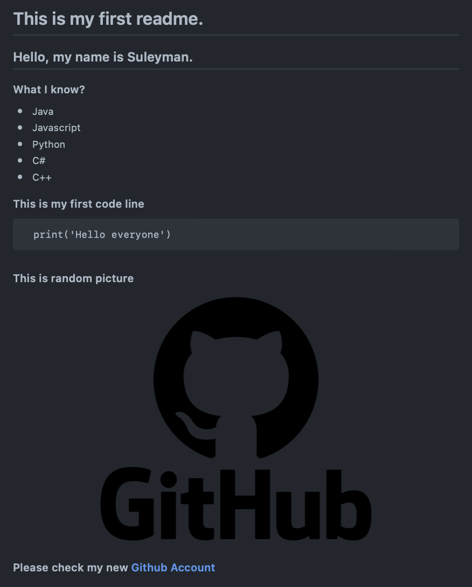

<h2>This is my first readme.</h2>
<h3>Hello, my name is Fuad</h3>
<h5>What I know?</h5>

* Java 
* Javascript 
* Python 
* C# 
* C++  

<h5>This is my first code line</h5>

`print("HelloWorld!")                                                                                    ` `      
<h5>This is random picture</h5>

<h5>Please check my new Github account</h5>
